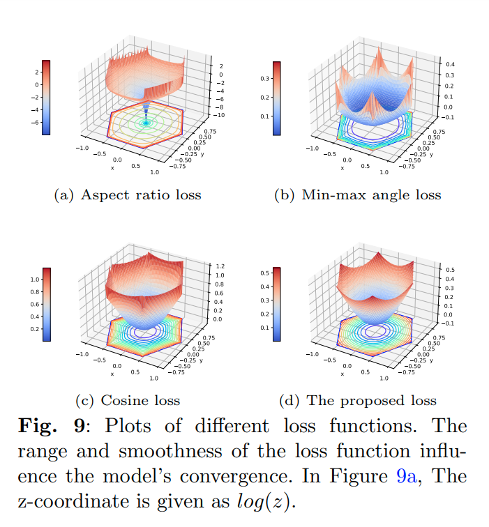
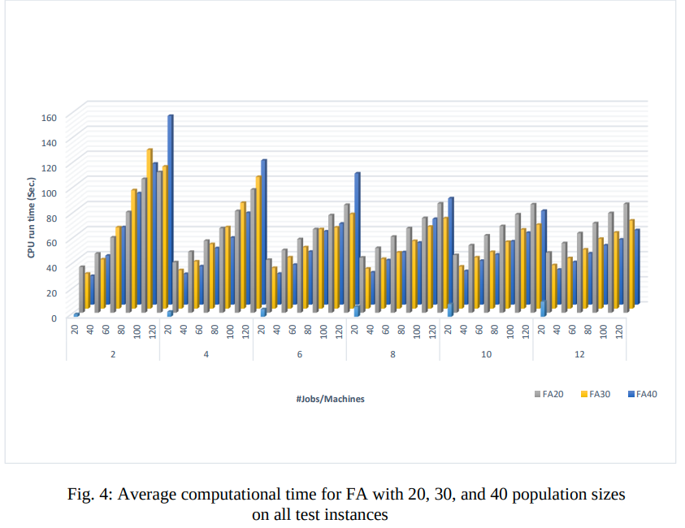
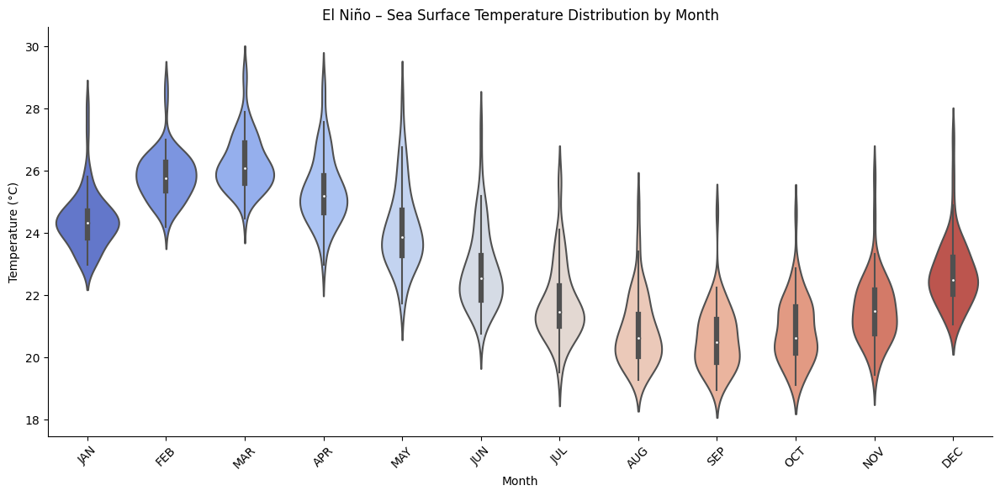
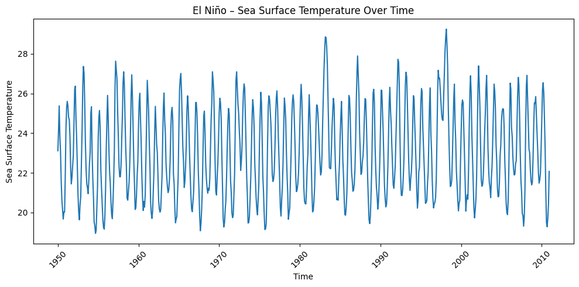

This README consists of two parts. 
Part 1: A good and 'bad' plot found on arXiv, based on tufte's rules and class discussion. 
Part 2: A plot from a past homework of mine, improved, and explained.

## Part 1

Figure 1: A good plot, showing good use of 3D and colors. The coloring is arguably redundant with the z-axis / 3d, but helps to visualize the 3d structure nonetheless.

Figure 2: A 'bad' plot. The plot attempts to demonstrate the effect of population size on computational efficiency for a particular algorithm. I chose this plot because the unjustified use of 3D distorts the graphic and makes it hard to comprehend. a 2D plot would enhance clarity, allow for a more accurate comparison across different conditions.

## Part 2

Figure 3: This violin plot effectively visualizes the El Niño sea surface temperature data, demonstrating a clear and concise representation of temperature distributions for each month. Adhering to Tufte's principles, this plot minimizes non-data ink and maximizes data ink, providing a clean and uncluttered view that emphasizes the actual data. Each violin shape allows for an easy comparison of distributions across months, highlighting median values and the spread of temperatures within each month. This visualization succeeds in following Tufte's guidelines by presenting complex data in a simple, informative, and aesthetically pleasing manner, facilitating better understanding and insight.

Figure 4: This figure illustrates the sea surface temperature data from the El Niño dataset using a line plot, which unfortunately becomes cluttered and visually overwhelming due to the dense data points. Each line represents a month, and their close proximity leads to difficulty in distinguishing individual trends, violating Tufte's principle of avoiding unnecessary noise in data presentation. The lack of clear differentiation between months and the dense plotting of data points make it challenging to extract meaningful insights. This visualization fails to apply Tufte's minimalist approach effectively, as it includes excessive data ink and lacks clarity in conveying the dataset's key patterns.
